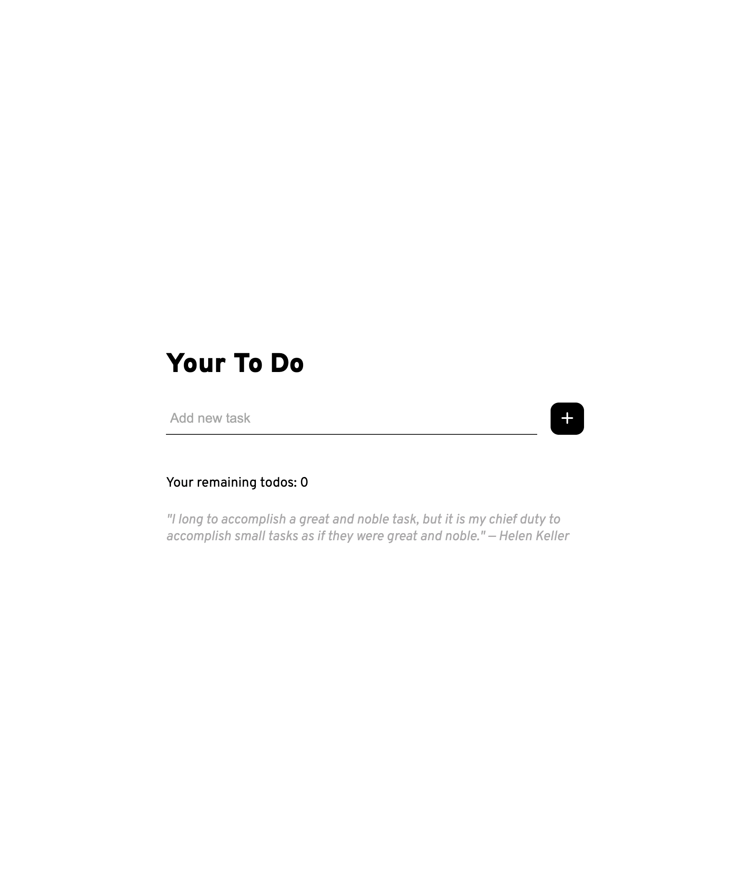
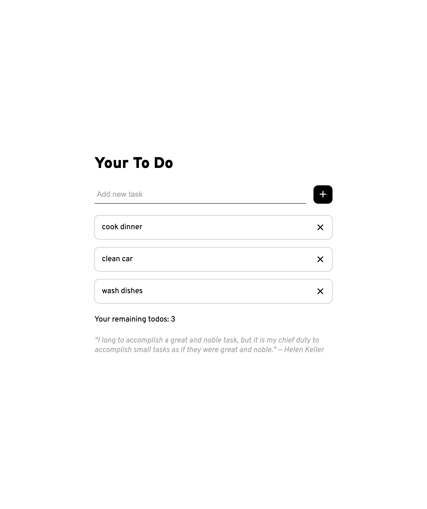
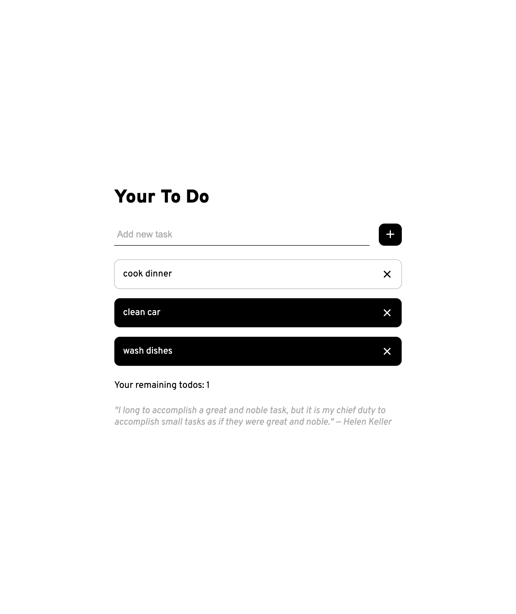

# Todo App

## Description

A simple and intuitive web-based Todo application built with HTML, CSS, and JavaScript. This app allows users to add, mark as complete/incomplete, and delete tasks, helping them stay organized and manage their daily todos efficiently.

## Features

- Add new todo items.
- Mark tasks as complete or incomplete by clicking on them.
- Delete tasks individually.
- Keeps track of the number of remaining (incomplete) todos.
- User-friendly interface.

## Technologies Used

- HTML5
- CSS3
- JavaScript (Vanilla JS)
- Font Awesome (for icons)

## Screenshots

Here are some screenshots of the application in action:

<!-- You can add your screenshots here. Example:

-->

## Design Inspiration

The design of this Todo App was inspired a Dribbble shot by [Arkan Naufal]. I have made a few personal tweaks and modifications to the original design to suit my own preferences.

## Author

[ru0te]
