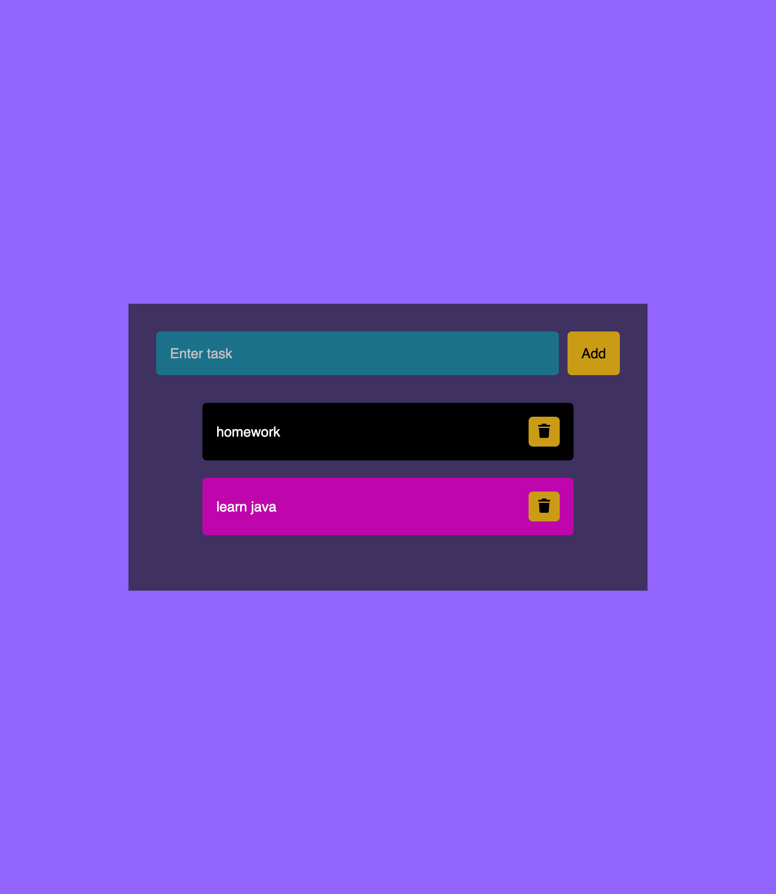

# Todo App

A simple todo list built with React, TypeScript, and Vite.



## Features

- Add todos
- Mark todos as complete
- Delete individual todos
- Delete all todos

## Getting Started

Install the dependencies:

```bash
npm install
```

Start the development server:

```bash
npm run dev
```

Build the app for production:

```bash
npm run build
```
